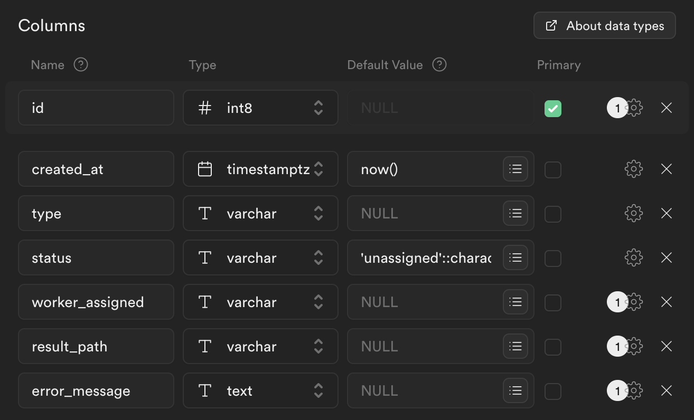
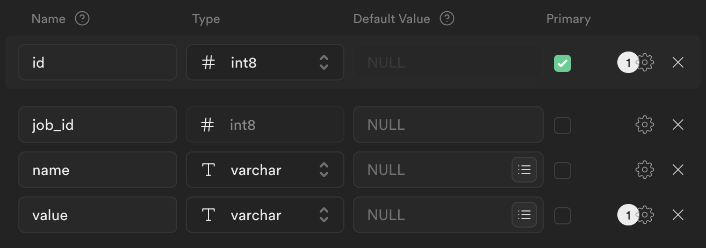

# 🖌️ CustomAIzed: A SaaS platform for creating image-based custom models


[](https://www.gnu.org/licenses/gpl-3.0)


CustomAIzed allow its users to generate customized images from models that they know new concepts taught by the user.

## 🫳🏼 Usage

The platform is designed to be easy to use, intended to be used by anyone, **without the need for technical knowledge**. In the demo that will be shown below, it is shown how to create new models that include in this case specific people. Once this model is generated, you can play with it to generate new images.


## 📽️ Demo

[](https://youtu.be/jzuAKhdGgM8)


## 📦 Features

- **Creation of customized models**: Users will be able to create customized models that understand specific concepts.
- **Image generation**: Once the model is created, new images can be generated from it.
- **Simple interface**: The user interface is designed to be simple and easy to use.
- **Scalable**: The platform is designed to be scalable and support a large number of users, implementing queues and facilitating vertical scalability.
- **Expandable**: The platform is designed to be expandable, allowing the creation of new models and functionalities.
- **Open Source**: The platform is open source, so anyone can contribute to its development.

## 🔧 Setup

In order to run the project, 3 components need to be configured: the database, the worker (gpu) and the user interface.

### Supabase

The following tables must be created in the Supabase database:

- **jobs**:

[]()

- **hyperparams**:

[]()

Also, 3 buckets must be configured in Supabase:
- results
- images
- models


### Install Dependencies

#### GPU worker

```bash
cd worker
sh install_deps.sh
wandb login #to track experiments (not mandatory)
export SUPABASE_URL="https://onquttuaucnydonwfoul.supabase.co"
export SUPABASE_KEY="XXX"
```

#### UI
    
```bash
cd ui
npm install
```

### Run

#### GPU worker

```bash
cd worker
python3 main.py
```

#### UI
    
```bash
cd ui
npm run dev
```

## 📜 License

Multiple licenses have been considered taking into account an analysis of the licenses of the libraries and technologies used. Initially, we wanted to establish a GPL v3 license (essentially for copyleft), but we considered that it was not the most appropriate for the project due to possible incompatibilities with the Stable Diffusion license. Therefore, we opted for the Apache 2.0 license (offers additional protections compared to the MIT license), a very permissive license that is being used by most of the libraries used. Above all, it has been taken into account that this license is used by Diffusers and therefore will generate problems with the stable diffusion license.

Therefore, the Apache 2.0 license is popular for its flexibility, providing developers with the freedom to modify, distribute, and sublicense their work. It promotes collaboration by allowing for both open and proprietary derivatives, fostering a diverse ecosystem of software innovation. Additionally, its patent protection clause offers reassurance to contributors and users, promoting a more inclusive and transparent development community.


- [Supabase](https://github.com/supabase/supabase/blob/master/LICENSE): Apache License 2.0
- [Stable diffusion](https://github.com/CompVis/stable-diffusion/blob/main/LICENSE): Creative ML OpenRAIL-M
- [Diffusers](https://github.com/huggingface/diffusers/blob/main/LICENSE): Apache License 2.0
- [Next.JS](https://github.com/vercel/next.js/blob/canary/license.md): MIT License
- [Tailwind CSS](https://github.com/tailwindlabs/tailwindcss/blob/master/LICENSE): MIT License


## 👫 Contributing
Contributions are always welcome.

See `CONTRIBUTING.md` for ways to get started. And please, respect the code of conduct for this project specified in `CODE_OF_CONDUCT.md`.

## 📈 Future work

As for future work, only fine tuning with model lora has been included. In this way, there are many lines of improvements, among them we highlight:
- New models included.
- Improvement of the user interface.
- Inclusion of new functionalities (ControlNet, Inpainting, SuperResolution...).


